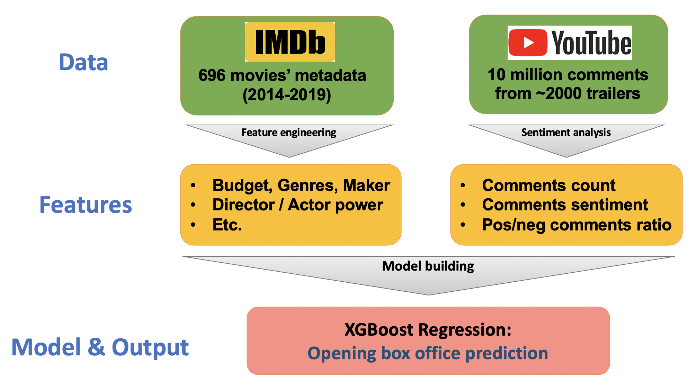

### Web app: http://trailerminer.me/
### Slides: https://docs.google.com/presentation/d/1eYL0SUBftpwC_WGlJPREZkFyGHv1ZnYtXUOBRxvJvUY

### Pipeline

## 1. Collection of movie metadata 

### 1.1. Get movie list from 2014-2019 for training data.
- Scrape top 150 movies of each year between 2014 to 2019, from www.boxofficemojo.com
- The results is stored in **./data/movie_list/**.

### 1.2. Collect metadata of each movie
- Scrape the metadata (tt_id, release_date, company, mpaa, genres, runtime, director, actors, budget, opening box office, gross box office, imdb_score) for each movie, from www.boxofficemojo.com and www.imdb.com.
- The results is stored in **./data/movie_list/**.
- This step is done in **01_collect_movie_metadata.ipynb**.

### 1.3. Get director power and actor power
- Calculate directors/actors' box office power and imdb power based their previous movie performance.
- A director/actor's box office power is the value of (box office / budget) averaging over his previous movies (starting from 2000).
- A director/actor's imdb power is the value of imdb_score averaging over his previous movies (starting from 2000).
- The results is stored in **./data/**.
- This step is done in **02_get_actor_director_power.ipynb**.

## 2. Collection of trailer data

### 2.1. From movie titles to get trailers' u_id on Youtube.
- Given the list of movie titles, get the corresponding trailer u_id on Youtube.
- Using Youtube Data API 'search' module. For each movie, keep the top 7 records.
- Then clean up the resutls to make sure they are indeed the trailer of the target movie.
- Record the trailers' u_id, viewCounts, commentCounts, likeCounts, dislikeCounts.
- The results is stored in **./data/trailer_list/**.
- This step is done in **11_get_trailer_list.ipynb**.

### 2.2. Using trailer's u_id to fetch tailer comments.
- Given trailers' u_id, fetching the comments of trailers on Youtube.
- Using Youtube Data API 'commentThreads' module.
- For each comment, record the timestamp, text, like_count, reply_count, author, and the trailer's u_id.
- The results is stored in **./data/trailer_comments_raw/**. One csv file correspond to one trailer.
- This step is done in **12_get_trailer_comments.ipynb**.

### 2.3. Trailer comments pre-processing.
- Clean-up records: remove comments whose text is null.
- Generate sentiment score: using pre-trained model (Textblob) to generate a sentiment score for each comment.
- Label whether a comment is made before or after movie's release.
- The results is stored in **./data/trailer_comments/**. One csv file correspond to one trailer.
- This step is done in **13_process_trailer_comments.ipynb**.

### 2.4. Get aggregated trailer features.
- Get the aggregated trailer features for model training, including 'trailer_commentCount', 'trailer_mean_sentiment', 'trailer_pos_sentiment_ratio', 'trailer_neg_sentiment_ratio'. and 'trailer_like_dislike_ratio'.
- This step is done in **14_get_trailer_features.ipynb**.

## 2. Sentiment analysis of trailer comments
- For current version, I'm using the pre-trained model of Textblob library for the sentiment analysis (which is trained from movie review data).

## 3. Box office prediction model

- XGBoost regression model.
- Regression target is the ratio of opening_box_office / budget.
- Train data: 593 movies in 2014 - 2018; Test data: 103 movies in 2019.
- 15-fold cross validation.